# Twenty Pancakes of the World

Pancakes are among humanity's most successful inventions.

They appear on nearly every inhabited continent, prepared from local grains, roots, and starches. Some are sweet. Some are savory. Some are fermented. Some are eaten daily while others appear only during festivals.

The list below is not exhaustive. It is simply a small tour through a much larger family of foods.

## 1. Dosa (South India)

Thin fermented rice-and-lentil pancake served with chutneys and sambar.

[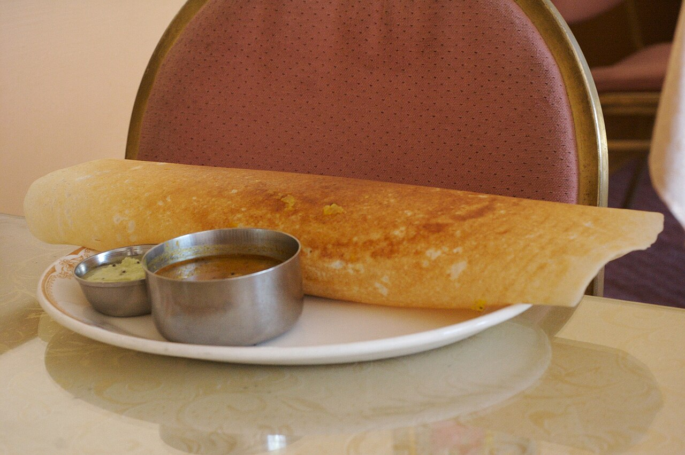](https://commons.wikimedia.org/wiki/File:Dosa-chutney-sambhar.jpg)

*Photo and license: Wikimedia Commons.*

## 2. Injera (Ethiopia)

Large fermented teff bread with a soft, porous texture.

[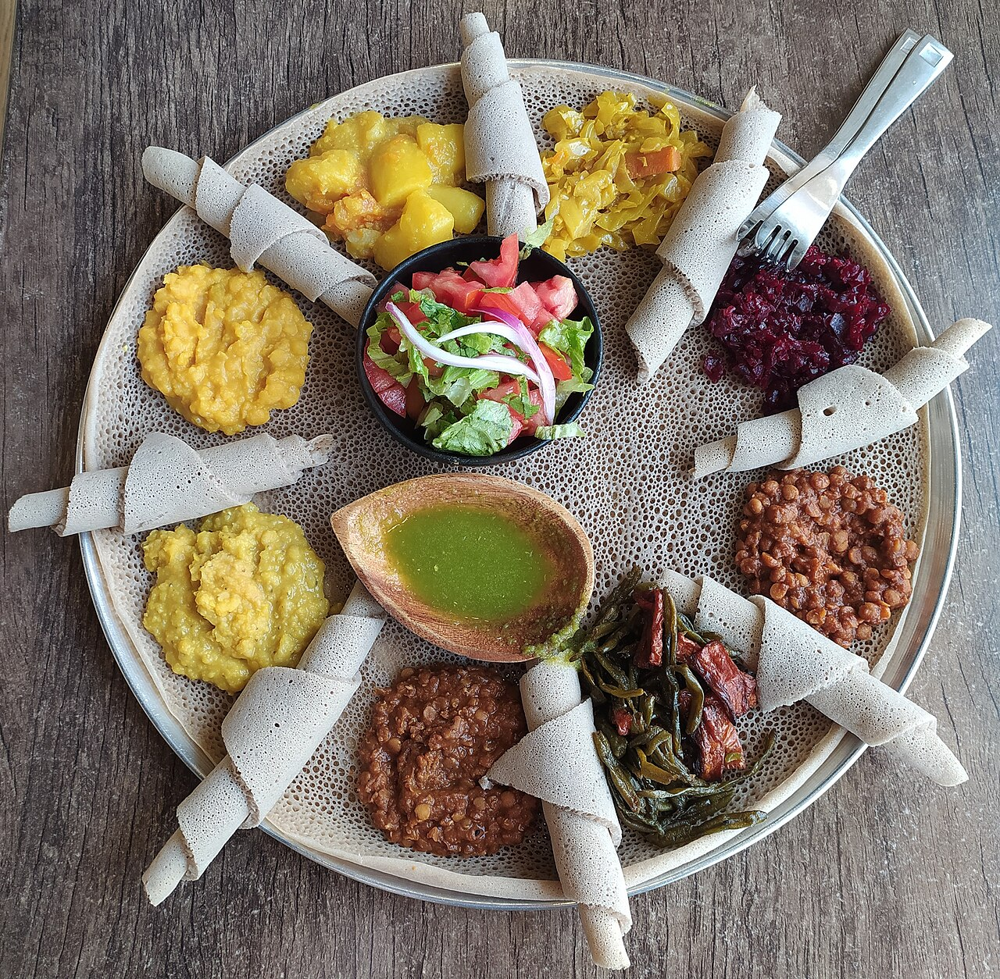](https://commons.wikimedia.org/wiki/File:Injera_with_eight_kinds_of_stew.jpg)

*Photo and license: Wikimedia Commons.*

## 3. Blini (Russia)

Small pancakes traditionally associated with Maslenitsa and seasonal celebrations.

[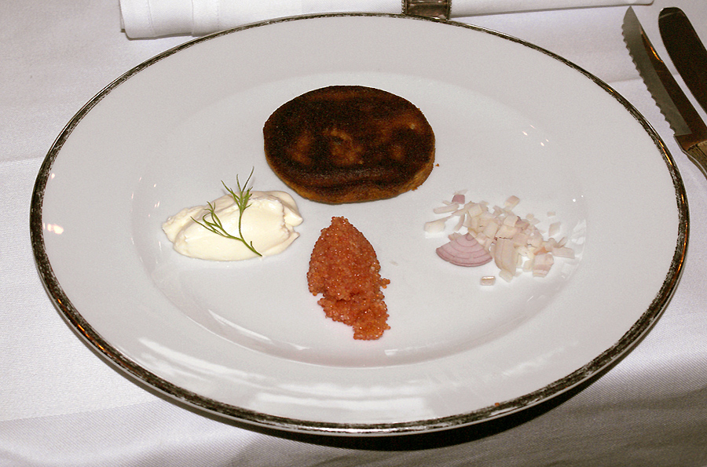](https://commons.wikimedia.org/wiki/File:Blini-Demidoff.jpg)

*Photo and license: Wikimedia Commons.*

## 4. Crêpe (France)

Thin pancakes served with sweet or savory fillings.

[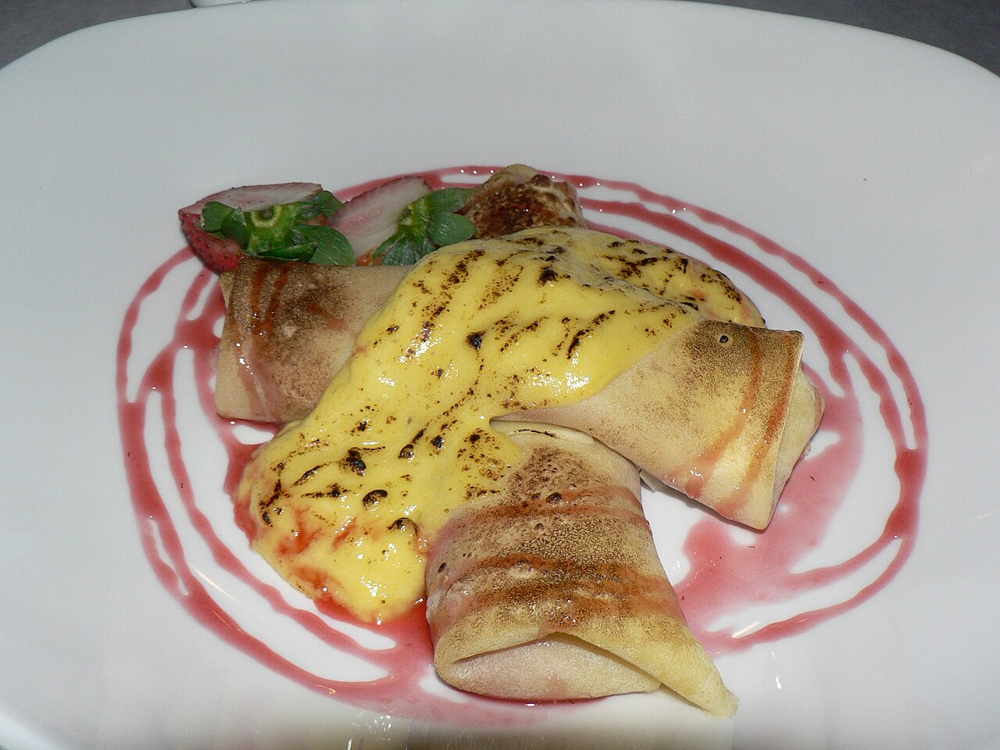](https://commons.wikimedia.org/wiki/File:Strawberry_crepes_with_zabaglione.jpg)

*Photo and license: Wikimedia Commons.*

## 5. Baghrir (Morocco)

Semolina pancakes covered with hundreds of tiny holes.

[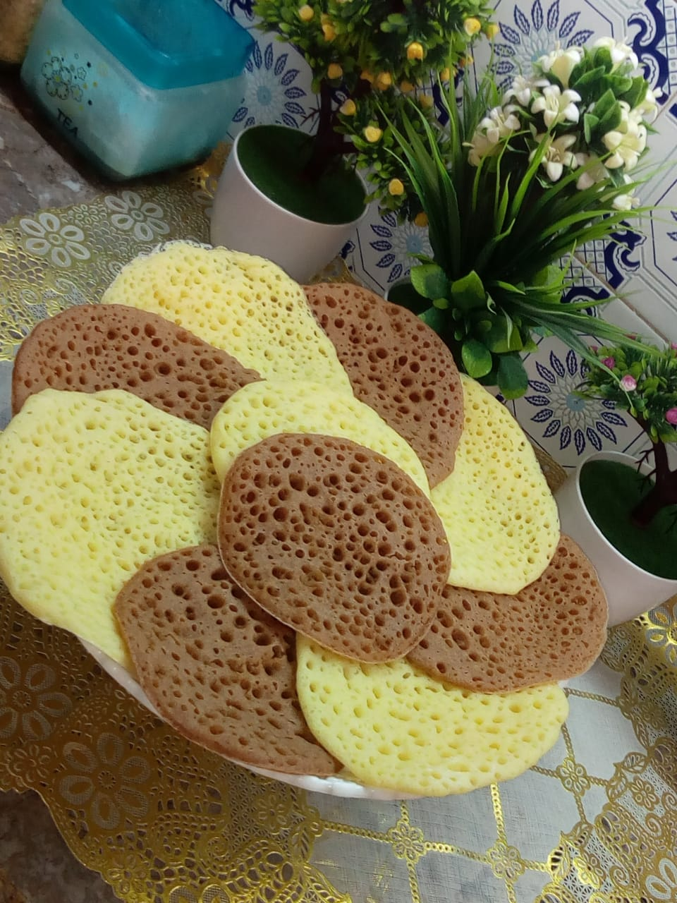](https://commons.wikimedia.org/wiki/File:%D8%A7%D9%84%D8%A8%D8%BA%D8%B1%D9%8A%D8%B1_%D8%A7%D9%84%D9%85%D8%BA%D8%B1%D8%A8%D9%8A.jpg)

*Photo and license: Wikimedia Commons.*

## 6. Okonomiyaki (Japan)

Savory cabbage pancake topped with sauces and seasonings.

[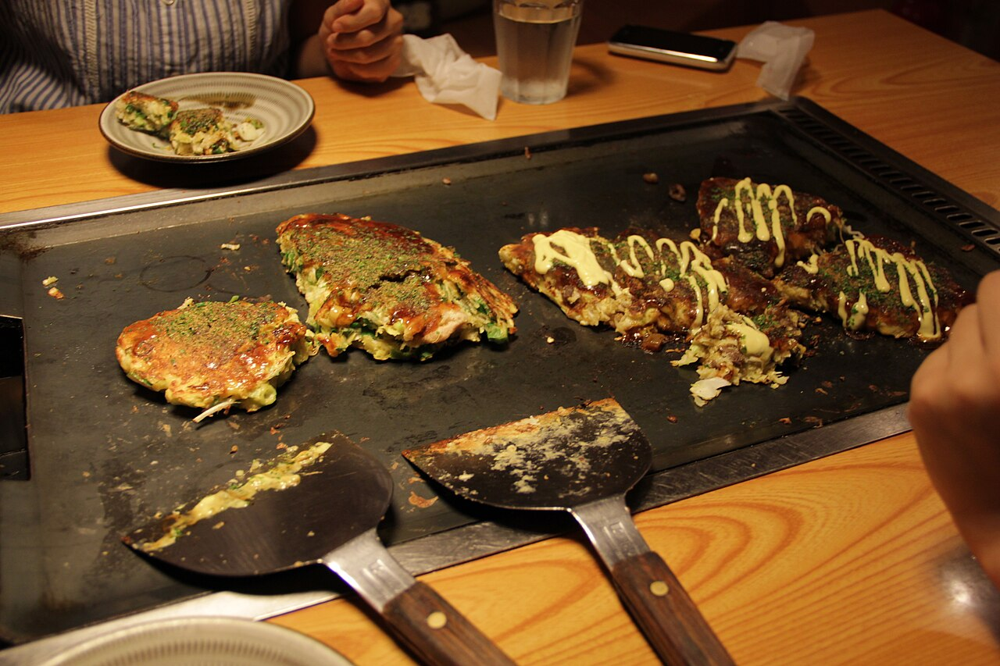](https://commons.wikimedia.org/wiki/File:Okonomiyaki_006.jpg)

*Photo and license: Wikimedia Commons.*

## 7. Jeon (Korea)

Savory pancakes incorporating vegetables, seafood, or kimchi.

[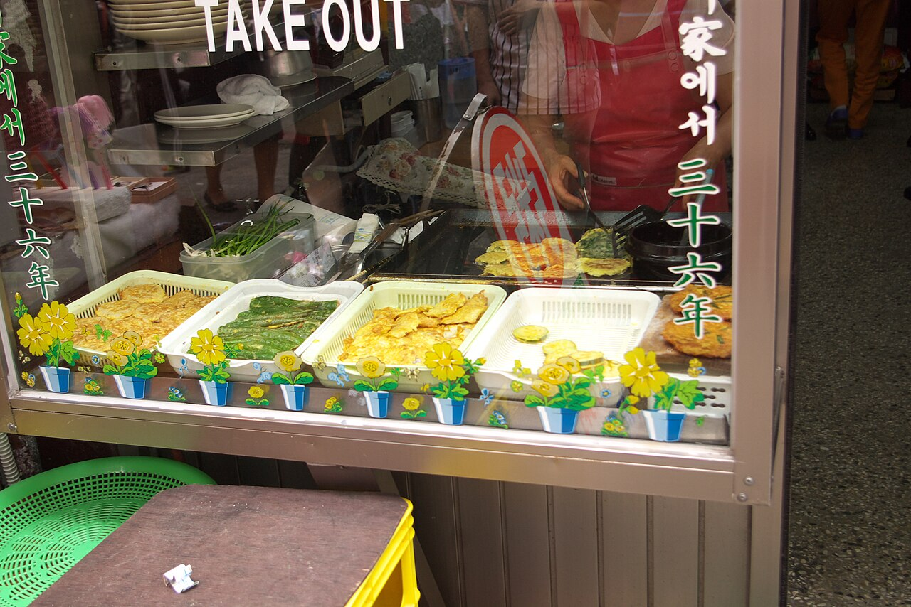](https://commons.wikimedia.org/wiki/File:Korean_pancake-Various_jeon-01.jpg)

*Photo and license: Wikimedia Commons.*

## 8. Scallion Pancake (China)

Layered flatbread flavored with scallions and oil.

[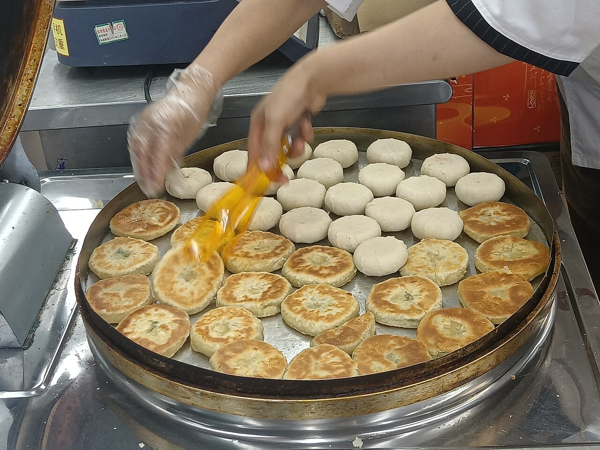](https://commons.wikimedia.org/wiki/File:Scallion_pancakes.jpg)

*Photo and license: Wikimedia Commons.*

## 9. Arepa (Venezuela and Colombia)

Corn-based cake split and filled with meats, cheese, or vegetables.

[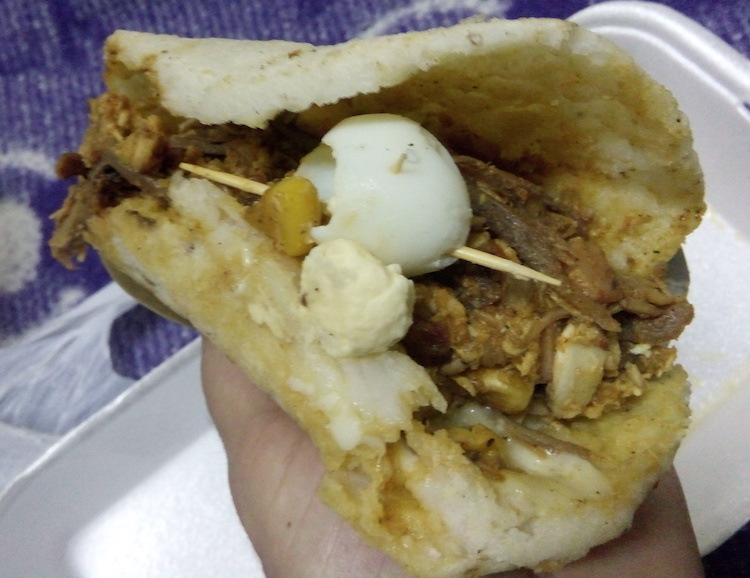](https://commons.wikimedia.org/wiki/File:Colombian_Food,_Arepas.jpg)

*Photo and license: Wikimedia Commons.*

## 10. Hoe Cake (Indigenous North America)

Cornmeal griddle cake with deep historical roots.

[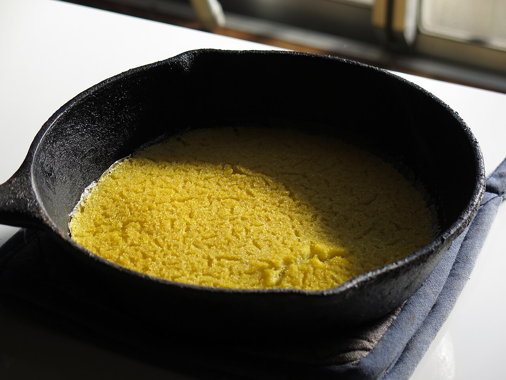](https://commons.wikimedia.org/wiki/File:Johnnycakes.jpg)

*Photo and license: Wikimedia Commons.*

## 11. Poffertjes (Netherlands)

Small fluffy buckwheat pancakes served with butter and sugar.

[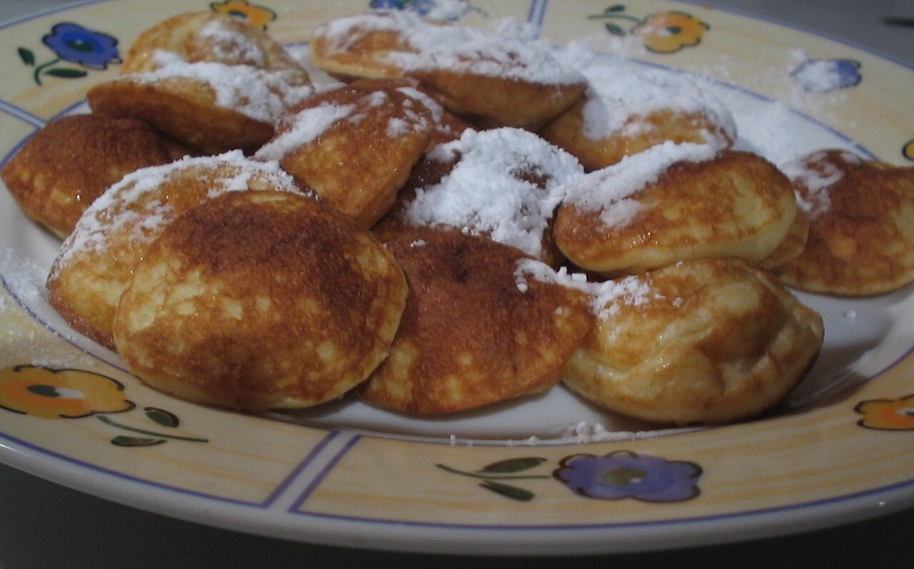](https://commons.wikimedia.org/wiki/File:Poffertjes_001.jpg)

*Photo and license: Wikimedia Commons.*

## 12. Pannkakor (Sweden)

Thin pancakes often served with berries.

[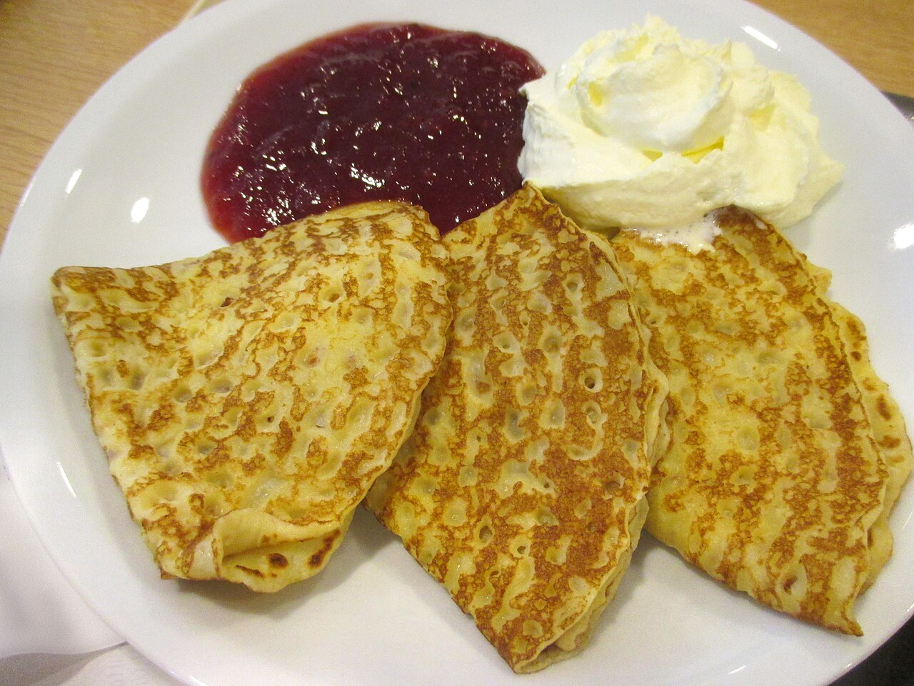](https://commons.wikimedia.org/wiki/File:Pannkakor_m_sylt_o_gr%C3%A4dde_1457.jpg)

*Photo and license: Wikimedia Commons.*

## 13. Naleśniki (Poland)

Filled pancakes wrapped around sweet or savory fillings.

[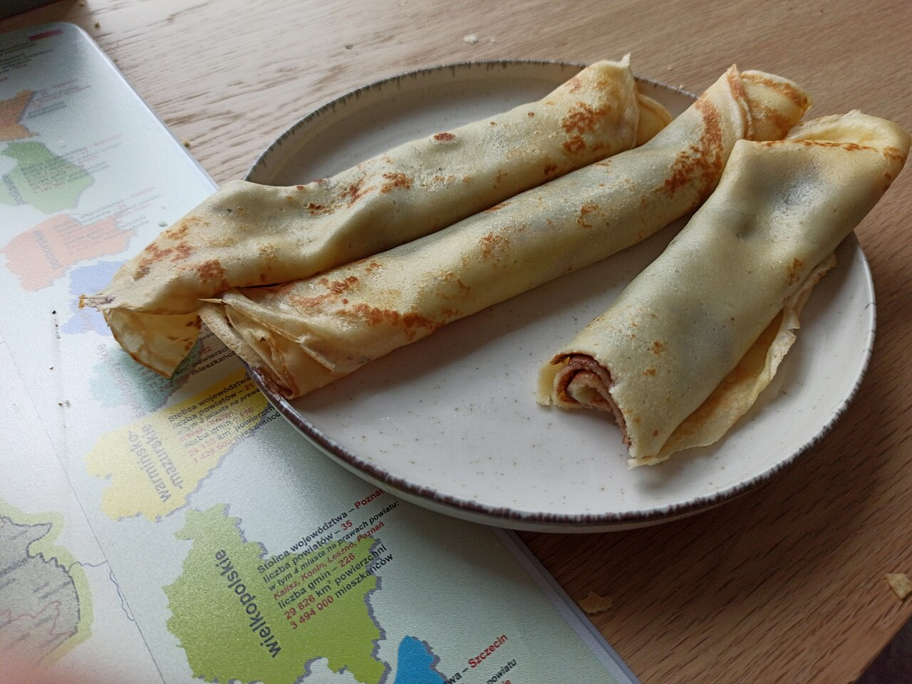](https://commons.wikimedia.org/wiki/File:Nale%C5%9Bniki.jpg)

*Photo and license: Wikimedia Commons.*

## 14. Bánh Xèo (Vietnam)

Large crisp turmeric pancake filled with vegetables and meat.

[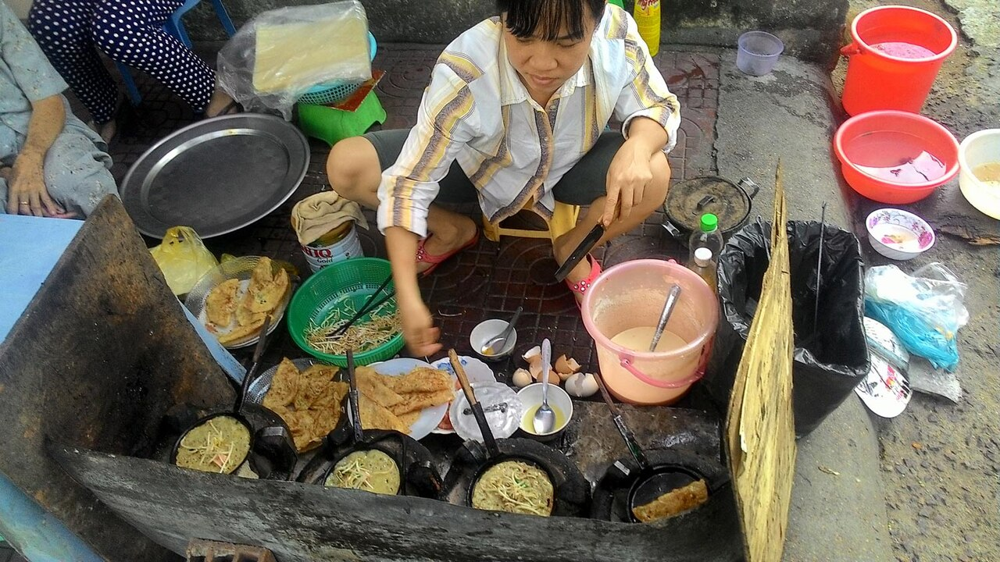](https://commons.wikimedia.org/wiki/File:Banh-xeo,-roving-street-vendor,-Quy-Nhon,-Vietnam.jpg)

*Photo and license: Wikimedia Commons.*

## 15. Hopper (Sri Lanka)

Bowl-shaped fermented rice pancake.

*Photo and license: Wikimedia Commons.*

## 16. Gözleme (Turkey)

Stuffed griddled flatbread filled with cheese, spinach, or meat.

*Photo and license: Wikimedia Commons.*

## 17. Raggmunk (Sweden)

Potato pancake traditionally served with lingonberries.

*Photo and license: Wikimedia Commons.*

## 18. Hotcake (North America)

Fluffy leavened pancake served with butter and syrup.

*Photo and license: Wikimedia Commons.*

## 19. Cassava Pancake (Amazon Basin)

Traditional griddle cakes made from cassava root.

*Photo and license: Wikimedia Commons.*

## 20. Ancient Grain Cake (Archaeological Reconstruction)

A hypothetical reconstruction of the earliest pancake traditions.

*Interpretive reconstruction; photo and license: Wikimedia Commons.*

### A Recipe for Exploration

The world's pancakes differ dramatically in ingredients, flavor, and appearance. Yet they all emerge from the same basic idea: transforming local plants into nourishing food through grinding, mixing, and heat.

In that sense, every pancake tells a story about the people who make it.
