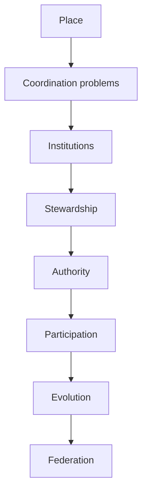

# Pancakes Place and Institutions

## Place as the Stable Substrate of Institutional Life

**Status:** Foundational

**Layer:** Institutional Engineering

**Companion to:**

* Pancakes Place Model
* Pancakes Institutional Engineering Methodology
* Pancakes Institutional Legitimacy
* Pancakes Institutional Participation
* Pancakes Authority Emergence Model
* Pancakes Institutional Evolution
* Pancakes Network Formation Model
* Pancakes Stewardship Model

---

# Abstract

Institutions coordinate human activity.

Places provide continuity.

Many institutions exist because coordination problems belong to places. Drinking water, flood control, roads, public health, emergency response, schools, and transit cannot be organized solely as relationships among freely associating individuals. The people who occupy a place share these problems whether or not they would independently choose the same institutional membership.

Other institutions arise from relationships among participants. Churches, cooperatives, professional associations, standards organizations, research collaborations, and open-source communities may operate across many places without claiming responsibility for everyone in any one of them.

This distinction between **place-bound** and **relationship-bound** institutions is not absolute, but it is foundational. It explains why institutions have different participation models, exit costs, legitimacy requirements, scopes of authority, and mechanisms of evolution.

This document connects the Pancakes Place Model to the broader institutional theory. It argues that healthy societies preserve the continuity of places while allowing the institutions serving them to change.

---

# 1. The Missing Layer

Pancakes institutional theory asks a series of related questions.

Institutional Engineering asks why an institution should exist and what coordination problem it should solve.

Authority Emergence asks how legitimate authority develops around responsibility and demonstrated capability.

Institutional Participation asks how people accept, inhabit, contest, change, or leave institutions.

Institutional Evolution asks how institutions adapt without destroying the continuity on which their participants depend.

Network Formation asks how institutions cooperate without collapsing local autonomy into centralized control.

Behind each of these questions is another:

> **Where do institutions exist?**

Institutions are often described as though they govern people in the abstract. Yet much institutional life is organized through relationships to places. A municipality serves the people who inhabit a city. A conservation authority responds to the properties and flows of a watershed. A transit agency coordinates movement through a service area. A public health unit responds to conditions shared by people within its jurisdiction.

The Place Model supplies the missing layer.

This diagram is not a rigid sequence. Authority can precede a formal institution. Participation can reshape a coordination problem. Federated relationships can produce new places of common concern. The diagram instead shows a dependency: institutional arrangements become intelligible only when we know what is being coordinated and where that problem exists.

Place is therefore not merely one more institution. It is part of the substrate from which institutions arise.

---

# 2. Places Outlive Institutions

The Pancakes Place Model defines a place as a meaningful relationship rather than merely a coordinate.

Coordinates locate.

Places accumulate relationships, memory, responsibility, and meaning.

A city is not identical to its municipal corporation. A neighbourhood is not identical to its ward. A watershed is not identical to its conservation authority. A school community is not identical to the board that currently administers it.

Institutions may be dissolved, merged, divided, renamed, or replaced while the places to which they relate continue.

A city may experience:

* government succession,
* municipal amalgamation,
* ward redistribution,
* police reorganization,
* transit restructuring,
* school board consolidation,
* utility mergers,
* changes in provincial or national constitutional arrangements.

The institutional layers change.

The city remains.

The same is true of ecological and cultural places. Rivers outlive water authorities. Neighbourhoods outlive planning regimes. Markets outlive the organizations that manage them. Libraries may move between administrative structures while continuing to occupy the same place in community life.

This does not mean that places are static. Their populations, ecosystems, built environments, names, uses, boundaries, and meanings can all change. Nor does it mean that the identity of a place is uncontested. It means that place provides a form of continuity different from organizational continuity.

An institution persists by reproducing its rules, roles, records, and practices.

A place persists through continuing relationships.

Institutional engineering should preserve the distinction. When an institution becomes incapable, illegitimate, or obsolete, changing it need not require treating the place itself as disposable. Conversely, preserving the name or boundaries of an institution does not necessarily preserve the relationships that make a place meaningful.

Healthy societies preserve places while allowing institutions to evolve around them.

---

# 3. Coordination Problems Have Geography

Not every coordination problem is spatial.

Some problems arise because people share a location, resource, ecology, or infrastructure. Others arise because people choose to pursue a purpose together.

Road maintenance is spatial. A failed bridge affects the people who rely on that crossing. Drinking-water safety is spatial. Contamination travels through a physical distribution system. Flood control is spatial. Water follows a watershed rather than the membership list of an organization.

Other forms of coordination need not attach to one place. A standards body coordinates agreement among producers and users. An open-source community coordinates work among contributors. A church coordinates worship and care among a community of faith. A research collaboration coordinates inquiry among participating researchers and institutions.

The first institutional-engineering question should therefore not be:

> Should this institution be public or private?

It should be:

> **Is the coordination problem fundamentally attached to a place?**

This question precedes familiar legal and political categories. A privately operated water utility may still be place-bound. A public standards body may still be relationship-bound. Ownership and legal form do not determine the geography of the underlying problem.

Several further questions follow:

* Does everyone occupying the place encounter the problem?
* Does the problem follow physical boundaries, service networks, ecological systems, or patterns of movement?
* Can people meaningfully decline participation while remaining in the place?
* Can several institutions address the problem concurrently?
* Would institutional competition produce meaningful choice, harmful fragmentation, or both?
* Does the appropriate boundary change depending on the capability being exercised?

These are engineering questions. They do not make political disagreement disappear, but they identify the architecture over which the disagreement occurs.

---

# 4. Place-Bound Institutions

A **place-bound institution** exists because its coordination problem belongs to a place.

Its responsibility is defined substantially by an area, physical system, catchment, or service relationship. Participation generally follows habitation, presence, or use more than personal affinity.

Examples include:

* municipalities,
* water and wastewater utilities,
* conservation authorities,
* road systems,
* public health units,
* emergency-response systems,
* transit authorities,
* land-use planning bodies,
* public school districts.

The institution does not necessarily govern every aspect of the place. It stewards a defined coordination problem within it.

A watershed authority does not own the watershed. It assumes responsibilities concerning water, flood risk, conservation, or related capabilities.

A municipality does not own the city as a lived place. It maintains civic capabilities within a defined jurisdiction.

A transit authority does not govern everyone who inhabits its service area. It coordinates mobility through networks that cross it.

This distinction is essential. Place does not produce unlimited authority. It defines the domain within which stewardship may be required.

## 4.1 Participation follows exposure

People participate in place-bound institutions because they are exposed to the conditions those institutions coordinate.

A resident cannot opt out of watershed hydrology.

A fire does not respect private membership.

An infectious disease does not consult institutional preference.

A road network cannot ordinarily provide one traffic system for each political or philosophical affiliation.

Place-bound participation is therefore often unavoidable even when formal participation is unequal or incomplete. A person may not vote, own property, attend public school, drive, or use a library card and still be affected by decisions about schools, roads, land use, public health, and civic infrastructure.

## 4.2 Boundaries follow problems imperfectly

Administrative boundaries rarely correspond perfectly to lived places.

Municipal borders may divide neighbourhoods.

Watersheds may cross municipalities.

Transit regions may lag behind commuting patterns.

School catchments may divide communities.

Public health regions may aggregate places with different needs.

The category *place-bound* therefore does not imply that an institution has found the correct boundary. It means that boundary design is part of the institutional problem.

## 4.3 Place-bound does not mean singular

More than one institution can operate over the same place.

Different institutions may coordinate different capabilities. Several institutions may also offer alternative ways of providing a similar capability. Place-bound institutions are not necessarily territorial monopolies.

The important question is whether plurality remains compatible with universal responsibility for the place.

---

# 5. Relationship-Bound Institutions

A **relationship-bound institution** exists because participants organize around a shared purpose, practice, commitment, identity, or exchange.

Examples include:

* churches,
* producer cooperatives,
* trade unions,
* professional associations,
* sports leagues,
* standards organizations,
* research collaborations,
* open-source communities.

Membership follows relationships rather than habitation.

The institution may have offices, buildings, facilities, local chapters, or a homeland. It may care deeply about particular places. That does not make its core participation place-bound. The institution exists because participants maintain their relationship to one another and to their shared purpose.

Relationship-bound institutions generally permit more direct forms of entry and exit. A participant may join another association, form a new one, remain unaffiliated, or participate in several at once.

This does not mean exit is always easy.

Leaving a religious community may involve family rupture.

Leaving a union may be legally constrained or economically consequential.

Leaving a professional association may end access to practice.

Leaving an open-source project may mean abandoning years of work and social identity.

Formal voluntariness does not eliminate dependency, power, or exit costs. The distinction concerns the source of institutional attachment, not the moral quality of the institution.

Relationship-bound institutions also remain situated. Their members live somewhere. Their activities use infrastructure, law, labour, land, and ecological resources. They participate in place-bound institutions even when their own membership crosses geography.

---

# 6. A Spectrum, Not a Binary

Place-bound and relationship-bound describe two architectural tendencies.

Many institutions combine them.

A neighbourhood association is relationship-bound in membership but organized around a place.

A cooperative utility may be place-bound in infrastructure and relationship-bound in ownership.

A university has a campus and local obligations but also maintains disciplinary, alumni, research, and credentialing relationships across many places.

A school board may serve a territorial catchment while allowing differentiated participation within it.

A nation may involve territory, citizenship, ancestry, law, language, and political membership in combinations that cannot be reduced to one axis.

Institutions can therefore be examined along several dimensions:

| Dimension | Place-bound tendency | Relationship-bound tendency |
| --- | --- | --- |
| Source of need | Shared conditions of a place | Shared purpose among participants |
| Basis of participation | Residence, presence, exposure, or use | Membership, commitment, affiliation, or agreement |
| Boundary | Territory, ecology, infrastructure, or catchment | Social relationship or declared membership |
| Exit | Often requires relocation or continued exposure | Often possible by ending or changing membership |
| Coverage obligation | Frequently universal within scope | Usually owed primarily to participants |
| Plurality | May be constrained by shared infrastructure | Often supports concurrent memberships |
| Legitimacy burden | Strong voice and public accountability | Meaningful consent and freedom of association |

This table is diagnostic rather than classificatory. It helps institutional engineers locate the pressures an institution must address.

---

# 7. Layered Institutional Geography

A place does not belong to only one institution.

One Toronto household may simultaneously relate to:

* Canada,
* Ontario,
* the City of Toronto,
* a municipal ward,
* a public health unit,
* a watershed,
* a conservation authority,
* a water utility,
* a library system,
* a transit authority,
* one or more school boards.

These are not redundant descriptions of one jurisdiction. Each layer coordinates a different problem.

The relevant geometry also differs.

The watershed is ecological.

The ward is representative.

The transit network follows mobility.

The library system follows civic service.

The school board follows an educational and constitutional architecture.

The household itself may maintain relationship-bound memberships that cross all of these layers: a congregation, a union, a cooperative, an online community, a sports league, or a research network.

Institutional geography is therefore polycentric. Many centres of responsibility overlap without combining into one total institution.

This layered view prevents a common modelling error: treating the largest jurisdiction as the container that gives every smaller institution its meaning. In practice, institutions relate both vertically and laterally. A conservation authority may cross municipal boundaries. A transit agency may require cooperation among municipalities. A local institution may participate directly in an international standards network.

Place supports institutional layers.

It does not dictate a single hierarchy.

---

# 8. Brexit: Constitutional Change Over Place

Brexit illustrates an institutional relationship whose consequences attached substantially to territory.

The United Kingdom's membership in the European Union was a constitutional relationship between political institutions. It shaped law, trade, movement, regulation, rights, funding, and cooperation across the territory and population of the United Kingdom.

The United Kingdom left the European Union on 31 January 2020. A transition period continued until 31 December 2020, during which EU law continued to apply in the United Kingdom under the Withdrawal Agreement. The institutional relationship then changed for the territory as a whole.[^1]

The relevant Pancakes observation is not whether leaving was wise.

It is not whether the referendum supplied sufficient legitimacy.

It is not whether any particular community benefited or suffered.

It is that constitutional participation followed place.

An individual UK resident who preferred continued membership could not preserve the former constitutional relationship personally. A business could not elect to remain inside the EU legal order in the same way that a person might retain membership in a professional association. A local majority could not independently preserve the complete membership arrangement for its locality.

The institutional change was collective because the relevant constitutional unit was collective.

Brexit also demonstrates that place and institution remain distinct.

The United Kingdom did not cease to exist as a place when its institutional relationship with the European Union changed. Cities, neighbourhoods, roads, ports, watersheds, and communities continued. What changed was the architecture connecting those places and their inhabitants to European institutions.

The case also exposes complexity rather than eliminating it. The United Kingdom contains several nations and multiple constitutional arrangements. Ireland and Northern Ireland required special institutional treatment because one territorial change intersected with another place-bound constitutional relationship. People retained family, commercial, cultural, and political relationships across the new institutional boundary.

Changing one institutional layer does not erase the other relationships of a place.

Brexit therefore illustrates both the power and the cost of place-bound constitutional change:

* the decision operates collectively,
* individual exit from the decision is difficult,
* internal disagreement persists after the institutional settlement,
* and the place must continue while its institutions renegotiate their relationships.

---

# 9. The Toronto Catholic District School Board: Plurality Over Place

Toronto's school-board architecture illustrates a different response to institutional difference.

Toronto remains one city. It has not been divided into separate Catholic and non-Catholic municipalities in order to sustain different public educational institutions. Instead, multiple publicly funded school systems coexist over the same geographic place.

The Toronto Catholic District School Board is territorial in one sense: it operates schools, assigns attendance areas, elects trustees by geographic wards, and serves communities within Toronto. Yet participation in Ontario's Catholic and public school systems is also differentiated through constitutional, religious, electoral, and enrolment relationships. Ontario describes four publicly funded school systems—English public, English Catholic, French public, and French Catholic—and its rules distinguish between residence, rights-holder status, school-board support, and admission.[^2]

The result is a hybrid architecture.

Education is place-bound because children require accessible schools, facilities occupy land, transportation has geography, and boards assume responsibilities within defined areas.

Participation is partly relationship-bound because institutional affiliation is not determined by municipal residence alone.

Several educational institutions can therefore overlay one city.

This does not prove that every aspect of the arrangement is equitable, efficient, or legitimate. It does not settle debates about religion, public funding, constitutional rights, admissions, taxation, or duplication. Those are separate evaluations.

The architectural lesson is narrower:

> Institutional plurality does not always require territorial separation.

When a coordination problem permits differentiated provision, people may sustain distinct institutions while continuing to inhabit a shared place.

The contrast with Brexit is not a comparison of political importance. It reveals two different institutional responses to disagreement.

In the Brexit case, one constitutional relationship changed for the territorial unit, and individuals inherited the result.

In the Toronto school-board case, multiple institutions coexist across much of the same territory, and participation can be differentiated without dividing the city.

| Architectural question | Brexit | Toronto school boards |
| --- | --- | --- |
| Shared place | United Kingdom | Toronto |
| Institutional issue | Membership in a supranational constitutional order | Provision and governance of public education |
| Primary settlement | Collective territorial change | Overlapping institutional plurality |
| Individual continuity of prior institution | Generally unavailable as constitutional membership | Differentiated participation remains possible within the city |
| Place after change or choice | The place continues | The place remains shared |

The comparison suggests that institutional engineering should ask not only whether disagreement exists, but whether the underlying capability can support concurrent institutions.

Some systems require common rules.

Some can be layered.

Some can permit individual selection.

Some can be federated.

Many require a mixture.

---

# 10. Place Constrains Institutional Design

An institution should be designed around the coordination problem it is responsible for, not around an inherited assumption about the proper scale of government or organization.

For each capability, institutional engineers should ask:

## 10.1 What is the place?

Is the relevant place:

* a building,
* a street,
* a neighbourhood,
* a municipality,
* a watershed,
* a transit region,
* a linguistic community,
* a nation,
* a distributed network with several homelands?

The answer may be plural. A school is simultaneously a building, a catchment, a community, an employer, and part of a wider educational system.

## 10.2 What follows the place?

Does the coordination problem follow:

* residence,
* physical presence,
* land,
* infrastructure,
* ecological flow,
* mobility,
* service use,
* legal status,
* or social membership?

Different answers produce different boundaries.

## 10.3 Is universal coverage necessary?

Some capabilities become unsafe or unjust when people are excluded. Fire protection, sanitation, infectious-disease response, and core infrastructure have strong place-wide effects.

Other capabilities can support partial or voluntary participation without undermining nonparticipants.

## 10.4 Can institutions coexist?

Plurality is more practical when:

* participants can select among institutions,
* infrastructures can be shared or duplicated safely,
* one institution's rules do not prevent another from functioning,
* minimum obligations to the place remain fulfilled,
* switching does not impose severe harms on others.

Plurality is harder when coordination requires one interoperable rule set, one physical network, or universal risk pooling.

## 10.5 What remains common?

Institutional diversity still requires a settlement concerning the shared place.

Multiple schools require common rules for child safety, credentials, funding, land, accessibility, and public accountability.

Competing utilities still require environmental constraints and infrastructure standards.

Federated municipalities still share watersheds, roads, economies, and emergency systems.

Plurality does not eliminate common stewardship. It specifies where difference can be sustained within it.

---

# 11. Place Shapes Participation

Institutional participation cannot be understood without institutional exit.

Leaving a church, cooperative, standards body, or open-source community differs fundamentally from leaving a municipality, watershed, public health region, or road network.

Exit from a relationship-bound institution may be difficult, but it is conceptually an exit from a relationship.

Exit from a place-bound institution often requires leaving the place—and even relocation may only exchange one institution for another institution of the same kind.

A person can leave a sports league without joining another.

A person cannot leave all systems of land-use regulation while continuing to occupy regulated land.

This produces different legitimacy requirements.

Where exit is comparatively available, consent and meaningful freedom of association carry much of the burden. The institution must allow participants to understand the relationship, join without deception, and leave without illegitimate retaliation.

Where exit is prohibitively expensive or functionally unavailable, the institution requires stronger mechanisms of:

* voice,
* representation,
* transparency,
* due process,
* accountability,
* appeal,
* constitutional constraint,
* minority protection,
* public stewardship.

Formal voting alone is insufficient. People experience place-bound institutions through services, decisions, delays, exclusions, maintenance, enforcement, and everyday administrative encounters. Participation includes the ability to report conditions, contest interpretations, propose changes, preserve local knowledge, and receive reasons.

The less realistically people can leave, the more carefully the institution must listen.

---

# 12. Place Shapes Authority

Place does not itself confer unlimited authority.

Authority emerges through responsibility for coordination problems and through demonstrated stewardship of them.

A watershed defines a domain of concern. Hydrology, ecology, settlement, and infrastructure create problems that require coordination. An authority becomes legitimate to the extent that it develops and exercises the capabilities needed to steward those problems responsibly.

A municipality stewards civic capabilities.

A transit authority stewards mobility.

A library board stewards access to shared knowledge and civic learning.

A school board stewards educational capabilities and the institutional conditions in which they are provided.

The place defines scope.

The coordination problem defines responsibility.

Stewardship grounds authority.

This formulation protects against two opposing errors.

The first is **territorial absolutism**: the belief that control over a jurisdiction grants authority over every relationship within it.

The second is **placeless administration**: the belief that formally assigned powers remain legitimate regardless of whether the institution understands or cares for the places affected by its decisions.

Healthy authority is bounded by capability and accountable to place.

Institutional boundaries should therefore be reviewable when they no longer match the problems being stewarded. A transit region may need to expand with patterns of movement. A watershed problem may require federation across municipal borders. A neighbourhood may require representation that an administrative boundary has obscured.

Authority should follow stewardship rather than forcing place to conform to administrative convenience.

---

# 13. Place Enables Institutional Evolution

Institutional evolution becomes easier to understand once place is separated from institution.

Governments succeed one another.

School boards merge or divide.

Transit agencies reorganize.

Utilities change ownership or governance.

Representative boundaries move.

Constitutional relationships are renegotiated.

The affected places continue to require water, mobility, learning, care, safety, memory, and belonging throughout the transition.

Place therefore supplies a test for institutional change:

> Does the new arrangement preserve or improve the capabilities through which this place can continue?

Institutional continuity remains important. Records, expertise, infrastructure, expectations, rights, and relationships cannot be discarded casually. But the purpose of continuity is not to preserve an organization for its own sake. It is to preserve the conditions under which people and places can continue while institutional forms change.

This distinction makes reform possible without institutional nihilism.

An institution can be criticized without denying the coordination problem it addresses.

An institution can be replaced without treating its accumulated knowledge as worthless.

A place can retain identity without freezing its present administration.

Evolution should preserve:

* essential capabilities,
* public memory,
* legitimate commitments,
* rights and protections,
* local knowledge,
* stewardship relationships.

It may change:

* roles,
* organizational boundaries,
* governance procedures,
* providers,
* federated relationships,
* technologies,
* constitutional arrangements.

Places provide continuity through institutional change, but institutions carry obligations across that change. The deeper continuity of place does not excuse careless transitions.

---

# 14. Place Enables Federation

Federation is cooperation among institutions.

It is not the merger of places.

Neighbourhoods can cooperate through a city.

Municipalities can cooperate through a transit region.

Communities can cooperate through watershed governance.

Nodes can cooperate through shared protocols and institutions while retaining distinct homelands, governance, and memory.

Federation becomes necessary when a coordination problem crosses the effective scope of one institution. Water flows across municipal boundaries. Transit crosses jurisdictions. Knowledge networks cross nations. Ecological systems connect settlements that otherwise govern themselves.

The federated institution should coordinate the shared capability without absorbing every local capability.

This is the principle of bounded federation:

> Coordinate at the scale of the problem while preserving stewardship at the scale of the place.

The principle resists both fragmentation and unnecessary centralization.

Pure localism fails when local decisions externalize harms or when no locality can provide the capability alone.

Total consolidation fails when a distant institution loses local knowledge, suppresses institutional diversity, or treats distinct places as interchangeable administrative units.

Federation allows places to remain themselves while their institutions cooperate.

Within Pancakes, this supports a polycentric architecture. Households, nodes, communities, projects, and institutions may form networks around shared protocols or capabilities without transferring all authority to the network. A federation receives only the scope required for the shared coordination problem.

---

# 15. Implications for Pancakes

The relationship between place and institution completes a foundational part of the Pancakes institutional architecture.

**Place asks:**

> Where does coordination occur?

**Institution asks:**

> What coordination problem is being solved?

**Authority asks:**

> Who should steward it, and within what scope?

**Participation asks:**

> How do people enter, inhabit, contest, change, and leave the institution?

**Evolution asks:**

> How can the institution improve while preserving necessary continuity?

**Network Formation asks:**

> How can institutions cooperate without sacrificing the integrity of the places and relationships they serve?

This framework has several practical consequences for Pancakes.

## 15.1 Place must remain first-class

Institutional records should relate capabilities, responsibilities, events, and stewardship to meaningful places rather than treating geography as incidental metadata.

## 15.2 Institutions must not own places

Nodes and institutions relate to places. They may steward defined capabilities. They do not acquire total interpretive or political ownership of the place.

No institution owns the meaning of a neighbourhood, watershed, school, library, or commons.

## 15.3 Place relationships must preserve privacy

Understanding which institutions matter to a household does not require continuous location tracking or a centralized household registry.

A node can know that a boil-water advisory is relevant because it understands a local water relationship. The advisory service need not know the household.

## 15.4 Capabilities should determine scope

An institution should receive the authority required for the capability it stewards, not a general claim over every activity within its area.

## 15.5 Plurality should be designed, not assumed

Institutional engineers should identify which capabilities require common provision, which permit parallel institutions, and which can support individual selection.

## 15.6 Evolution should preserve place memory

When institutions change, their records and responsibilities should preserve the histories, commitments, and local knowledge needed by the places that continue.

---

# 16. Closing Principle

Places provide continuity.

Institutions provide coordination.

Authority provides stewardship.

Participation provides legitimacy.

Evolution provides adaptation.

Federation provides cooperation across difference.

The institutional form is not the place.

The jurisdiction is not the community.

The administrative boundary is not the whole relationship.

Places persist through changing layers of institutional life. Healthy institutions recognize that they are stewards within those relationships, not owners of them.

The foundational principle is therefore:

> **Preserve places. Let institutions evolve. Assign authority to demonstrated stewardship. Build participation in proportion to the cost of exit. Federate at the scale of the problem.**

---

[^1]: The [Council of the European Union's withdrawal timeline](https://www.consilium.europa.eu/en/policies/the-eu-uk-withdrawal-agreement/timeline-eu-uk-withdrawal-agreement/) records the United Kingdom's departure on 31 January 2020 and the transition through 31 December 2020.

[^2]: See the Government of Ontario's overview of [the province's publicly funded school systems](https://www.ontario.ca/page/your-childs-education-parent-guide-our-school-system). The example concerns the architecture of overlapping systems; it does not imply that every Toronto resident has identical eligibility, enrolment, electoral, or tax-support choices among them.
