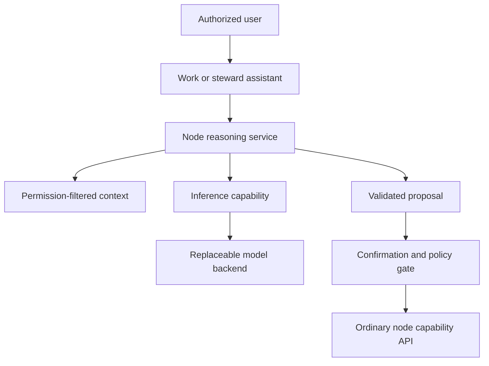
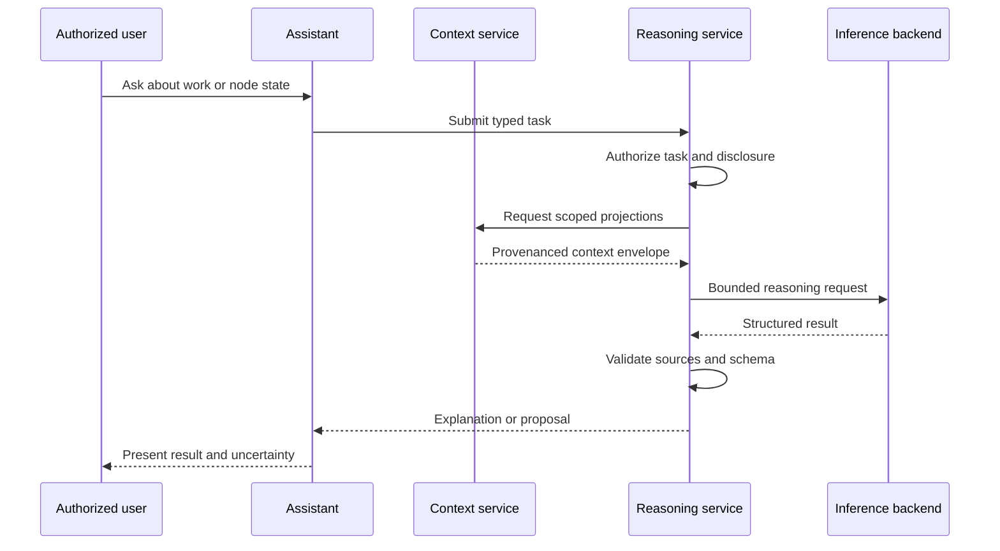
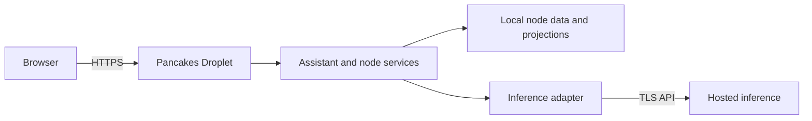

# Pancakes Remote Inference and Node Reasoning Architecture

## Status

Proposed

Initial applications:

- Pancakes work assistance
- Pancakes node stewardship and management assistance

Companion to:

- Pancakes Client and Node Architecture
- Pancakes Node Architecture
- Pancakes Node Capabilities
- Pancakes Reference Services
- Pancakes Information Sources
- Pancakes Privacy and Security guidance

---

## Purpose

This document defines an architecture in which a small, continuously available Pancakes node can use language-model reasoning without hosting the model itself.

The node hosts the application, permissions, data, context assembly, workflows, and durable records. A separate inference backend supplies compute-intensive text generation. The resulting system can reason about Pancakes work and the activity or condition of the node while remaining independent of a particular model, GPU host, or inference provider.

The central deployment decision is:

> The Pancakes node owns context, authority, and action. A replaceable inference backend processes bounded reasoning requests.

This permits a modest CPU Droplet to remain online continuously while capable models run elsewhere only when needed.

## Intended Uses

The first system should support two related areas of assistance.

### Pancakes Work Assistance

The assistant may help a person understand and organize work represented in the node, including:

- current projects, plans, and open work;
- recent document or repository changes;
- requirements, design decisions, risks, and validation results;
- dependencies between projects or capabilities;
- outstanding reviews and approvals;
- explanations of Pancakes architecture and operating procedures;
- preparation of summaries, checklists, reports, and candidate work plans.

### Node Stewardship Assistance

The assistant may help an authorized steward understand and manage the deployment, including:

- installed capabilities and their operational state;
- scheduled and background jobs;
- application health and recent failures;
- storage, database, and backup status;
- available updates and pending maintenance;
- configuration or deployment drift;
- audit events and security-relevant warnings;
- likely causes of operational problems;
- proposed maintenance or recovery procedures.

The assistant should be useful even when it is read-only. Acting on the node is a separate capability with stricter controls.

## Scope

This document defines:

- the boundary between the Pancakes node and remote inference;
- how node context is selected, projected, and disclosed;
- the separation between inference, reasoning, and action;
- the responsibilities of work and stewardship assistants;
- privacy, security, reliability, and operational requirements;
- supported deployment arrangements;
- an incremental implementation plan.

It does not define:

- a particular language model;
- a permanent inference vendor;
- unrestricted general-purpose chat;
- image, audio, or video generation;
- hidden monitoring of node participants;
- autonomous node administration;
- automatic governance decisions;
- model training or continuous self-modification.

## Architectural Fit

Pancakes applications consume stable node capabilities rather than depend on particular servers, databases, or deployment topologies. Language-model support should follow the same rule.

The architecture preserves the established division of responsibility:

```text
Nodes govern.

Capabilities provide behavior.

Reference services describe the world.

Information sources observe the world.

Pitchfork accounts.

Products compose capabilities.

Clients present experiences.
```

Artificial intelligence does not replace any of these layers. It consumes explicitly selected outputs from them and returns interpretations or proposals.

## Three Distinct Responsibilities

The architecture distinguishes three responsibilities that should not be collapsed into one chatbot process.

### Inference

Inference turns a bounded prompt into generated output. It is a computational service and should know as little as possible about the internal organization of the node.

### Node Reasoning

Node reasoning selects permission-appropriate context, identifies the task, constructs a grounded request, validates the response, and relates the result back to node records.

### Node Action

Node action changes state. It uses ordinary node capability APIs, permissions, validation, confirmation, and audit. Inference output never constitutes authorization.

This produces the governing rule:

> The model may propose. The node decides whether the proposal is valid and authorized. A person or approved policy decides whether it will be executed.

## System Context



The always-on Pancakes node is the trusted application boundary. A remote inference backend is a scoped processor outside that boundary unless it is operated locally by the same node steward.

## Components

### Assistant Clients

Clients present task-oriented experiences rather than an unrestricted command line for the model.

Initial experiences may include:

- **Ask about Pancakes work** — answer a question using selected project materials and current work state;
- **Summarize node activity** — describe relevant recent events for the requester;
- **Explain node status** — interpret health, capability, job, storage, or backup projections;
- **Investigate a problem** — correlate selected alerts, status reports, recent changes, and logs;
- **Prepare work** — draft a plan, checklist, report, or change proposal;
- **Propose maintenance** — produce an explicit, reviewable procedure without executing it.

Clients do not store inference credentials and do not query internal databases directly.

### Node Interface

The Node Interface is the stable boundary between assistant clients and node services. It provides:

- identity and session management;
- permission checks;
- capability discovery;
- projections of node state;
- search and reference services;
- audit access appropriate to the requester;
- the node reasoning service;
- ordinary capability APIs for separately authorized actions.

Authentication and authorization occur before context is assembled or sent to inference.

### Node Context Service

The Node Context Service constructs a bounded representation of the node for a particular task and requester. It does not give the model unrestricted database or filesystem access.

Possible context sources include:

- project documents, plans, and decision records;
- repository revisions and validation reports;
- capability manifests and operational status;
- node events and projections;
- scheduled jobs and recent job results;
- deployment and configuration metadata;
- backup status and restore-point metadata;
- resource-use summaries;
- alerts and structured error records;
- audit records visible to the requester;
- reference services relevant to the task.

Every context item should contain:

- a stable source identifier;
- source type;
- authority or reliability class;
- creation or observation time;
- freshness information;
- provenance;
- data classification;
- permission scope;
- exact content disclosed to the model.

The service should prefer structured projections over raw records. For example, it should provide a backup-status projection rather than access to backup archives, and a bounded error record rather than an entire application log.

### Permission-Filtered Projections

The assistant may reason only from information the current task is permitted to use.

The normal rule is:

```text
requester identity
-> task permission
-> permitted source set
-> bounded projection
-> inference request
```

Administrative access to one class of node information does not imply permission to disclose unrelated personal information to a model. A steward investigating database health does not thereby gain an AI-readable projection of private journals, health information, or household activity.

AI-specific disclosure scopes should be narrower than ordinary read permissions where appropriate. The node may permit a person to view a record while prohibiting that record from being sent to an external inference service.

### Node Reasoning Service

The Node Reasoning Service converts a user request into a governed reasoning task. It is responsible for:

1. authenticating the requester;
2. identifying the task type;
3. checking the relevant permission and disclosure scopes;
4. retrieving current projections and reference material;
5. constructing a context envelope;
6. selecting a model service level;
7. requesting structured output;
8. validating the returned schema and source references;
9. distinguishing observations, interpretations, and proposals;
10. saving a result when node policy permits;
11. routing any proposed action through a separate confirmation path.

Initial task types may include:

- `answer_work_question`;
- `summarize_project_state`;
- `summarize_node_activity`;
- `explain_operational_status`;
- `investigate_incident`;
- `prepare_work_plan`;
- `review_proposed_change`;
- `propose_maintenance_procedure`.

Each task type declares permitted data classes, required projections, output schema, model limits, retention behavior, and whether action proposals are allowed.

### Inference Capability

The inference capability is a reusable infrastructure capability. It accepts a provider-independent generation request and returns a normalized response.

Its responsibilities are:

- capability discovery and health reporting;
- model-alias resolution;
- provider authentication;
- request translation;
- timeout and retry policy;
- concurrency and usage control;
- response normalization;
- latency and cost measurement;
- safe error reporting;
- optional backend failover.

It must not:

- discover node information on its own;
- bypass context filtering;
- determine user permissions;
- execute node actions;
- modify its own task policy;
- expose provider-specific behavior to clients;
- silently substitute a materially different model policy.

### Backend Adapter

A backend adapter translates the stable inference contract into a particular runtime API. Provider-specific fields remain inside the adapter.

The rest of the node uses service-level aliases such as:

```text
node-fast
node-reason
node-second-opinion
```

An alias describes an intended service level rather than a vendor or model. Its exact binding is deployment configuration and is recorded with every result.

### Remote Inference Backend

The backend loads a language model and performs generation. It may be:

- a hosted commercial API;
- an open-model inference provider;
- a temporary GPU virtual machine;
- a permanently operated GPU host;
- a local CPU or GPU runtime on a more capable node.

The backend is replaceable. It does not own user identity, permission state, node context, action authority, or durable work records.

### Proposal and Action Gateway

The Proposal and Action Gateway is optional and should not be part of the first read-only deployment.

When enabled, it accepts typed proposals rather than arbitrary model-generated commands. A proposal might request:

- creation of a work item;
- scheduling of a maintenance window;
- rerunning a failed validation job;
- preparation of a backup;
- restart of a named noncritical service;
- installation of an approved update.

The gateway:

1. validates the proposal schema;
2. resolves every target locally;
3. performs a fresh permission check;
4. evaluates node policy;
5. presents the exact action and consequences to the user;
6. requires confirmation where policy demands it;
7. invokes the ordinary capability API;
8. records the outcome in the audit service.

The model never receives a general shell, database connection, unrestricted filesystem tool, or administrator credential.

## Context Envelope

A context envelope is the complete, reviewable disclosure sent for one reasoning task.

An illustrative envelope is:

```json
{
  "task_type": "explain_operational_status",
  "request_id": "req-...",
  "requester_scope": "node.steward.read",
  "policy_version": "node-reasoning-v1",
  "question": "Why have document validation jobs been delayed?",
  "context": [
    {
      "source_id": "ctx-001",
      "source_type": "job_status_projection",
      "observed_at": "2026-08-23T16:00:00Z",
      "fresh_for_seconds": 60,
      "classification": "node_internal",
      "provenance": "scheduler-capability",
      "content": {
        "queue_depth": 14,
        "active_workers": 0,
        "last_worker_error": "worker unavailable"
      }
    }
  ],
  "output_schema": "node-explanation-v1",
  "limits": {
    "max_output_tokens": 1500,
    "temperature": 0.1
  }
}
```

The context envelope should be inspectable by an authorized user. It establishes what the model was allowed to know and makes later review possible.

## Normalized Reasoning Result

The model should return structured distinctions between source-backed observations, interpretations, uncertainty, and proposals.

An illustrative result is:

```json
{
  "request_id": "req-...",
  "status": "completed",
  "model_alias": "node-reason",
  "backend_binding": {
    "provider": "configured-backend",
    "model": "exact-model-and-variant",
    "adapter_version": "1"
  },
  "policy_version": "node-reasoning-v1",
  "result": {
    "observations": [
      {
        "statement": "No workers are active while fourteen jobs are queued.",
        "source_ids": ["ctx-001"]
      }
    ],
    "interpretations": [
      {
        "statement": "The unavailable worker is the likely immediate cause of the delay.",
        "confidence": "high",
        "source_ids": ["ctx-001"]
      }
    ],
    "unknowns": [
      "The supplied context does not identify why the worker became unavailable."
    ],
    "proposals": [
      {
        "proposal_type": "inspect_worker_health",
        "target": "document-validation-worker",
        "requires_confirmation": false
      }
    ]
  },
  "finish_reason": "stop"
}
```

The node validates the result against a local JSON Schema. Unknown context identifiers, unsupported proposal types, malformed output, and truncation produce an incomplete result rather than a successful one.

## Request Lifecycle



If a user chooses to act on a proposal, that begins a separate authorization and execution flow.

## Reasoning and Authority Boundaries

The assistant may:

- summarize visible node activity;
- explain current projections;
- correlate several supplied records;
- distinguish observed facts from likely causes;
- identify missing information;
- prepare work plans and reports;
- propose bounded next steps;
- explain the expected consequences of a proposed action.

The assistant may not independently:

- change permissions or governance policy;
- install or remove capabilities;
- delete data or backups;
- rotate credentials;
- expose private information;
- restart critical infrastructure;
- approve its own proposed action;
- treat an inference as an authoritative node fact;
- monitor information that the requester could not otherwise access.

A larger or more capable model does not receive broader authority. Model capability and node permission are independent.

## Relationship to Node Knowledge

The assistant does not possess a complete internal representation of the node. It reasons from a task-specific projection assembled at a particular time.

Every response should make clear:

- what was directly observed in the context;
- what was inferred;
- which records support the inference;
- when the records were observed;
- what relevant information was unavailable;
- whether the state may have changed since context assembly.

For time-sensitive node management, the reasoning service should refresh critical status immediately before presenting or executing a proposal.

## Privacy and Security

### Trust Boundary

The remote backend is outside the node's primary trust boundary unless it is operated by the same steward under equivalent controls. TLS protects data in transit but does not prevent the backend operator from processing plaintext prompts.

Every outbound request is therefore a governed disclosure.

### Permission Before Projection

The existence of information in the node does not make it available to the assistant. Identity, permissions, purpose, data classification, and backend policy are evaluated before a projection is created.

The system should enforce:

```text
No inference without a permitted projection.

No action without a separate permission check.
```

### Data Minimization

The reasoning service should send:

- the current task;
- only the projections needed for that task;
- the applicable reasoning instructions;
- opaque request and source identifiers;
- the required output schema.

It should not send by default:

- complete databases or repositories;
- unrelated conversation history;
- raw intimate records;
- entire log files;
- secrets or credentials;
- cryptographic keys;
- unfiltered audit history;
- information from unrelated capabilities.

### Data Classification

Every context source and backend configuration should declare supported data classes.

| Data class | Examples | Default external-inference policy |
| --- | --- | --- |
| Public | Published Pancakes documentation | Permitted |
| Project internal | Work plans, nonsecret configuration metadata | Permitted only by project policy |
| Node internal | Health, jobs, deployment state, audit summaries | Permitted only to an approved backend |
| Personal | Private tasks, journals, household records | Denied by default |
| Sensitive or regulated | Health, dependent, financial-vulnerability, identity records | Denied without a separately approved design |
| Secrets | Credentials, keys, recovery material | Never disclosed |

Local inference may permit tasks that external inference does not, but local processing does not remove ordinary user-permission requirements.

### Credentials

Provider credentials remain on the node and are available only to the inference adapter. They must not be:

- placed in the browser;
- committed to Git;
- included in prompts;
- returned in errors;
- written to ordinary application logs.

### Logging and Retention

Operational logs should contain request IDs, task types, model bindings, timing, token counts, disclosure classes, and error categories. Full prompts and responses should not be placed in infrastructure logs.

Reasoning records may be retained in application storage under node policy. A retained record should preserve the context envelope, output, model and policy versions, human disposition, and any resulting action record. Users should be able to see what node information was disclosed for a saved result.

### Prompt Injection and Untrusted Content

Node documents, logs, messages, imported records, and external information may contain instructions intended to manipulate the model.

The reasoning service should:

- label context as data rather than instructions;
- separate trusted task policy from retrieved content;
- restrict outputs to task-specific schemas;
- ignore tool or permission requests embedded in source material;
- treat proposed actions as untrusted until locally validated;
- preserve the provenance of externally supplied content;
- avoid granting action authority to a model merely because its output is well formed.

### Network Controls

The public interface should expose only the reverse proxy and application endpoints. Databases, internal capability endpoints, and any self-hosted model endpoint remain private. Outbound inference traffic should be restricted to configured backend destinations where practical.

## Reliability and Failure Handling

Remote inference can fail independently of the node.

The inference capability should support:

- explicit health states: `available`, `degraded`, and `unavailable`;
- bounded connection and generation timeouts;
- concurrency and usage limits;
- queued asynchronous work for long tasks;
- cancellation when supported;
- retries only when safe;
- circuit breaking after repeated failures;
- clear separation of backend failure from invalid model output;
- preservation of the user's request when inference fails.

Core node operation must not depend on model availability. Capability status, ordinary search, deterministic checks, dashboards, audit access, backups, and manual administration remain usable without inference.

The system must not interpret a timeout, refusal, malformed response, or absent warning as evidence that the node is healthy.

## Deployment Topologies

### Initial Topology: Small Node and Hosted Inference



This is the simplest continuously available deployment. A small CPU Droplet hosts the node, assistant, and context services. The remote backend charges per use and requires no model operations on the node.

### Temporary Self-Hosted GPU

The inference adapter may target a GPU virtual machine created for evaluation sessions, large work summaries, or maintenance investigations. The GPU machine hosts only the model runtime and a private authenticated API.

The machine should be disposable:

- configuration is reproducible;
- model and runtime versions are pinned;
- durable results remain on the Pancakes node;
- the GPU host retains no authoritative node state;
- the instance is destroyed when no longer needed.

### Permanent Separate GPU Host

A permanent GPU backend becomes reasonable only when sustained usage, privacy requirements, latency, or API expenditure justify its operational burden. It remains a replaceable service and does not become the location of the node's durable state.

### Local Tiny Model

A node may satisfy the same inference contract with a small local model. Local inference improves privacy, offline operation, and cost predictability, but provides less reasoning capacity and competes for node CPU and memory.

Tiny models may be especially useful for:

- classifying operational messages;
- extracting structured fields;
- selecting relevant projections;
- summarizing short status records;
- formatting reports;
- routing difficult tasks to a larger backend.

Applications do not need to know which topology is active.

## Initial Host Shape

For one or a few users, the always-on node can remain modest because it does not load the primary language model.

A practical initial shape is:

```text
2 shared vCPU
4 GB RAM
80-100 GB SSD
Ubuntu LTS
```

A 1-vCPU, 2-GB node may be sufficient for a demonstration with strict concurrency and memory controls. Four gigabytes provides safer headroom for the operating system, web application, Git working trees, SQLite indexes, background jobs, and deployment operations.

The remote backend determines model capacity. It may range from a metered API to a GPU host sized for the selected model. That decision remains outside the node contract.

## Application and Service Layout

The first implementation does not require microservices. One deployable Python application may contain clear internal modules for:

```text
authentication and permissions
assistant workflows
context projections
task orchestration
inference capability
backend adapters
proposal validation
result storage
audit records
```

A reverse proxy terminates HTTPS and forwards requests to the application server. SQLite is appropriate for early personal or internal use. A background worker may be added for asynchronous reasoning without splitting the entire application into independent services.

The architectural boundaries should be preserved in code even when they share one process.

## Capability Relationships

The design uses several cooperating capabilities rather than treating all AI behavior as one capability.

| Responsibility | Architectural role |
| --- | --- |
| Inference | Infrastructure capability providing model access |
| Context projection | Node service enforcing provenance, permission, and minimization |
| Node reasoning | Reusable orchestration over projections and inference |
| Work assistant | Product or client composition for Pancakes project work |
| Steward assistant | Product or client composition for node operations |
| Action gateway | Optional controlled bridge to ordinary node capability APIs |

This allows inference to be reused without granting every inference consumer access to node-management information.

## Inference Capability Manifest

An illustrative manifest is:

```yaml
capability: inference
version: 1
category: infrastructure

operations:
  - generate_structured
  - report_status

required_capabilities:
  - identity
  - permissions
  - audit

optional_capabilities:
  - scheduler
  - notifications

permission_scopes:
  - inference.use
  - inference.use_node_internal
  - inference.admin

data_classes:
  - public
  - project_internal
  - node_internal

features:
  text_generation: true
  structured_output: true
  images: false
  audio: false
  training: false
  direct_node_actions: false
```

Backend configuration is not part of the public manifest. Capability discovery reports supported operations and availability without exposing credentials or unnecessary provider details.

## Model and Policy Management

Reasoning behavior can change when the model, quantization, prompt policy, runtime, context projection, or provider changes. Each saved result should retain:

- model alias;
- exact resolved model identifier;
- quantization or serving variant where applicable;
- backend adapter version;
- task and policy version;
- output-schema version;
- source and projection versions;
- generation settings;
- timestamp and request ID.

Changing a model alias or reasoning policy is a controlled deployment change. It should be tested against a Pancakes-specific regression set before becoming the default.

The regression set should include:

- accurate summaries of work and node state;
- stale or conflicting projections;
- missing context where the correct response is uncertainty;
- plausible but incorrect incident diagnoses;
- private records that must never enter a context envelope;
- prompt injection embedded in documents or logs;
- unsafe maintenance proposals;
- invalid targets and renamed capabilities;
- actions requiring confirmation;
- ordinary situations where no action is needed.

Evaluation should measure factual grounding, source validity, distinction between observation and inference, unsafe disclosure, false alarms, missed problems, proposal safety, schema compliance, latency, and cost. General model benchmarks are secondary.

## Deterministic Services

Language-model reasoning should complement rather than replace ordinary system logic. The node should determine directly:

- whether a service is running;
- whether a backup completed;
- whether a capability is installed;
- whether a job failed;
- whether storage exceeds a threshold;
- whether a permission is granted;
- whether a proposed target exists;
- whether an output satisfies its schema;
- whether a maintenance action requires confirmation.

The model may interpret these facts, relate them to other context, or explain them to a person. It should not manufacture basic operational truth that the node can calculate deterministically.

## Implementation Phases

### Phase 1: Read-Only Local Harness

- Define several work and node-status task schemas.
- Implement a small set of permission-filtered projections.
- Implement one inference adapter.
- Run the assistant locally with no action gateway.
- Build a regression set from realistic Pancakes work and node-management cases.

### Phase 2: Internal Droplet

- Deploy behind HTTPS and authentication.
- Store provider credentials outside source control.
- Enforce task permissions, disclosure scopes, and data classifications.
- Add structured operational logging and saved reasoning records.
- Limit access to trusted users.
- Make context envelopes inspectable.

### Phase 3: Backend and Model Comparison

- Bind the same service aliases to several candidate backends in controlled tests.
- Compare tiny local models, hosted models, and larger temporary GPU models.
- Select defaults using Pancakes-specific evidence.
- Define escalation rules for difficult tasks or second opinions.

### Phase 4: Controlled Proposals

- Add typed action proposals without execution.
- Validate proposal targets, permissions, and consequences locally.
- Evaluate whether proposals are useful and safe.
- Add confirmation and execution only for a small allowlist of reversible actions.

### Phase 5: Operational Hardening

- Add asynchronous jobs for long tasks.
- Add circuit breaking, budgets, backup, export, and retention controls.
- Document backend replacement and recovery procedures.
- Conduct privacy and security review before expanding data classes or action types.

## Acceptance Criteria for the First Deployment

The first deployment is successful when:

- the Pancakes node runs continuously without a local GPU;
- an authorized user can ask bounded questions about Pancakes work or node state;
- context is assembled from current, provenanced projections;
- permissions and AI-disclosure policy are checked before inference;
- only the scoped context envelope is sent to the configured backend;
- the backend can be replaced without changing assistant workflows;
- responses distinguish observations, interpretations, unknowns, and proposals;
- source identifiers resolve only to supplied context;
- model, policy, and projection versions are recorded;
- the assistant cannot execute node actions;
- ordinary node operation remains useful while inference is unavailable.

## Open Questions

The following decisions should be made through prototyping:

- Which initial experience is more valuable: work assistance or stewardship assistance?
- Which node projections should exist before the assistant is built?
- Which project and node-internal information may be sent to an external backend?
- Should the node keep complete context envelopes or minimize retained reasoning history?
- What freshness guarantees are needed for operational questions?
- Which tasks can a tiny local model handle reliably?
- When should the node escalate to a larger model or request a second opinion?
- Which reversible actions, if any, should eventually be available through confirmed proposals?
- Which administrative actions must always remain outside AI-assisted execution?

## Closing Principle

Remote inference should extend a Pancakes node without becoming its governor, observer, or administrator.

The node remains the governed home of identity, permissions, context, durable records, and action. The model receives a bounded projection, returns a fallible interpretation, and holds no independent authority. This separation allows Pancakes to reason about its work and operational condition without requiring an expensive always-on GPU, exposing the node indiscriminately, or making one model provider part of the node's permanent architecture.
